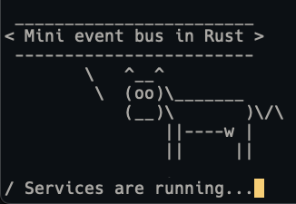

# Mini Event Bus



An event-driven Hub and Spoke architecture built with Rust and Tokio.

## Features

- [x] Mini Event Bus with `tokio`
- [ ] Tracing with `tracing`
- [ ] Observability with `jaeger` and `grafana`

## Sample Run

```
Running Event Bus
Creating Cowsay Service
Preload some events for testing
Running services
Running Cowsay service
 ________________________
< Mini event bus in Rust >
 ------------------------
        \   ^__^
         \  (oo)\_______
            (__)\       )\/\
                ||----w |
                ||     ||

 ________________________
< Mini event bus in Rust >
 ------------------------
        \   ^__^
         \  (oo)\_______
            (__)\       )\/\
                ||----w |
                ||     ||

 ________________________
< Mini event bus in Rust >
 ------------------------
        \   ^__^
         \  (oo)\_______
            (__)\       )\/\
                ||----w |
                ||     ||

Received SIGINT
Sending shutdown signal to all running services
Waiting for all connected services to shutdown
cowsay: Received shutdown request
cowsay: Cleaning up
cowsay: Shutting down
All services shutdown
Network shutting down
```
